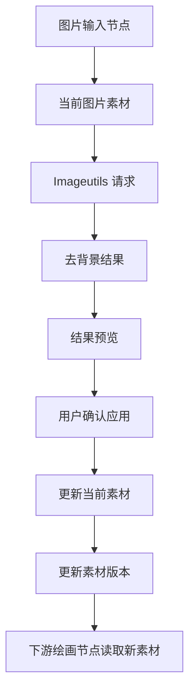

# Imageutils 背景去除接口协议模板

本文档用于收集“图片输入节点新增 Imageutils 背景去除功能”所需的接口协议信息。当前阶段只维护协议模板，不新增代码实现，不修改节点 UI。

## 暂缓原因

该需求依赖 Imageutils 的真实 API 协议。缺少 baseUrl、鉴权方式、输入格式、输出格式、超时和计费限制时，直接实现容易导致接口不兼容或误处理用户图片。

## 目标功能说明

后续实现时，图片输入节点应能对当前图片素材执行背景去除，生成透明背景结果，并允许用户预览和应用到当前节点或下游绘画节点。

推荐交互策略：

1. 用户在图片输入节点点击“背景去除”。
2. 前端调用 Imageutils 背景去除接口。
3. 返回结果先作为派生结果预览，不直接覆盖原图。
4. 用户确认“应用”后，更新图片输入节点当前素材。
5. 当前素材版本变化后，下游绘画节点应读取新素材，旧历史不得继续作为当前输入。

## 建议数据流



## 接口协议模板

| 字段 | 必填 | 说明 | 示例 |
|---|---|---|---|
| baseUrl | 是 | Imageutils API 地址 | `https://api.example.com` |
| endpoint | 是 | 背景去除接口路径 | `/v1/remove-background` |
| method | 是 | HTTP 方法 | `POST` |
| auth | 是 | 鉴权方式 | `Bearer token` / `x-api-key` |
| authHeader | 否 | Header 名称 | `Authorization` |
| input | 是 | 图片输入格式 | `multipart`, `base64`, `url`, `blob` |
| inputField | 是 | 图片字段名 | `image` / `file` |
| output | 是 | 返回格式 | `transparent_png_url`, `base64_png`, `binary_png` |
| outputField | 是 | 返回字段路径 | `data.image_url` |
| supportsAlpha | 是 | 是否返回透明 PNG | `true` |
| maxImageSize | 否 | 最大图片大小 | `10MB` |
| maxResolution | 否 | 最大输入分辨率 | `4096x4096` |
| timeoutMs | 是 | 超时时间 | `60000` |
| billing | 否 | 计费或调用限制 | `per image` |
| rateLimit | 否 | 频率限制 | `60 rpm` |
| errorSchema | 是 | 错误返回结构 | `error.message` |
| retryPolicy | 否 | 可重试错误范围 | `429`, `5xx` |

## 待补充协议

```json
{
  "baseUrl": "待补充",
  "endpoint": "待补充",
  "method": "POST",
  "auth": {
    "type": "待补充",
    "header": "待补充"
  },
  "request": {
    "contentType": "待补充",
    "imageField": "待补充",
    "additionalFields": {}
  },
  "response": {
    "format": "待补充",
    "imageFieldPath": "待补充",
    "errorFieldPath": "待补充"
  },
  "limits": {
    "timeoutMs": 60000,
    "maxImageSize": "待补充",
    "maxResolution": "待补充",
    "rateLimit": "待补充"
  }
}
```

## 后续实现前检查项

- 确认是否返回透明 PNG。如果只返回白底图，需要重新评估是否符合“背景去除”预期。
- 确认是否支持本地 Blob/File 上传，或必须先上传为 URL。
- 确认接口是否允许浏览器直接调用；如果不允许，应走可选本地网关或代理能力。
- 确认 API Key 不应写入源码或文档示例。
- 确认失败时不覆盖原图片输入节点素材。
- 确认应用去背景结果后，会触发图片输入节点素材版本更新，避免下游绘画节点继续使用旧输入。

## 后续建议实现颗粒度

1. 先补齐本协议并由业务侧确认。
2. 新增 Imageutils API 封装层，不直接散写在 [`src/App.jsx`](../src/App.jsx)。
3. 在图片输入节点新增去背景按钮和执行状态。
4. 将去背景结果作为派生结果预览，不默认覆盖原图。
5. 应用结果时复用图片输入节点素材版本更新机制。
6. 验证失败重试、取消、超时和下游节点联动。

