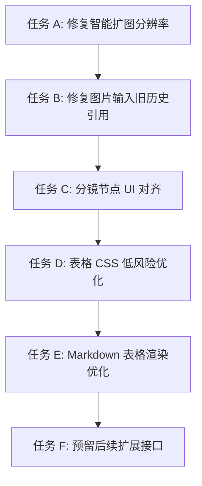
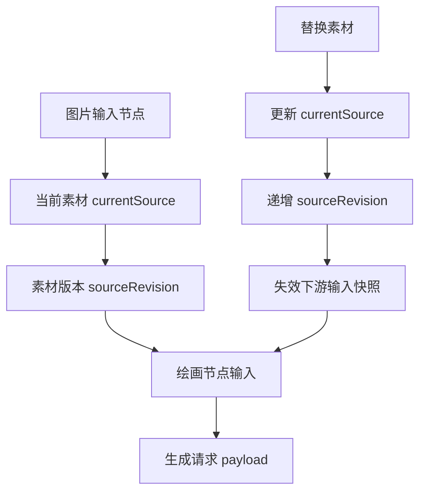

# AI Coding 更新计划

本文档固定近期可由 AI coding 顺序执行的更新工作。计划暂时排除“画布常用绘画/视频模型新增全量官方渠道”和“图片输入节点新增 Imageutils 背景去除功能”的代码实现；这两项依赖外部渠道清单和接口协议，先保留为待补充文档。

## 计划边界

本阶段纳入以下 4 类可执行工作：

1. 修复图片输入节点替换素材后，下游绘画节点仍留存旧历史/旧素材的问题。
2. 修复智能扩图选择 2K/4K 时，请求参数被发送为 1K 的问题。
3. 更新分镜图表节点部分 UI 功能，使其与现有画布节点交互对齐。
4. 优化表格编辑/Markdown 表格渲染 CSS 占用较大的问题。

暂不纳入以下 2 项代码实现：

1. 画布常用绘画/视频模型新增全量官方渠道。
2. 图片输入节点新增 Imageutils 背景去除功能。

原因：这两项依赖外部模型/渠道清单和 Imageutils API 协议，不适合在信息不足时直接实现。

## 当前项目约束

- 核心画布、节点、生成流程、分镜 UI、Markdown 样式高度集中在 [`src/App.jsx`](../src/App.jsx)，单次改动需要控制范围，避免大面积重构。
- Markdown 基础样式同时出现在 [`src/index.css`](../src/index.css) 和 [`src/App.jsx`](../src/App.jsx)，表格性能优化应优先收敛样式职责，而不是一次性重写渲染系统。
- 分镜工具能力已在 MCP 层存在：[`src/mcp/toolRegistry.js`](../src/mcp/toolRegistry.js) 和 [`src/mcp/toolExecutor.js`](../src/mcp/toolExecutor.js)，UI 对齐时应复用已有动作入口。
- 模型路由能力已存在于 [`src/api/modelRouter.js`](../src/api/modelRouter.js) 和 [`src/api/schemas.js`](../src/api/schemas.js)，但本阶段不新增官方渠道数据。
- 遵守 [`docs/development-conventions.md`](./development-conventions.md)：画布新增字段保持向后兼容，高频交互优先使用 `useRef`、节流和 RAF 合并。

## 推荐执行顺序

## 工作包 A：修复智能扩图 2K/4K 被发送为 1K

### 目标

保证用户在智能扩图 UI 中选择 1K、2K、4K 时，最终发送到生成接口的请求参数与 UI 选择一致。

### A1. 定位分辨率状态与请求映射

- 只读梳理 [`src/App.jsx`](../src/App.jsx) 中智能扩图相关状态字段。
- 找出 UI 选择值、节点 settings 保存值、请求 payload 字段之间的映射关系。
- 输出当前映射链路，确认 2K/4K 在哪一步被覆盖为 1K。

验收：

- 能明确指出字段名和覆盖位置。
- 不修改功能逻辑。

### A2. 统一智能扩图分辨率映射表

- 在 [`src/App.jsx`](../src/App.jsx) 内建立或整理统一映射逻辑。
- 禁止在请求提交阶段再次使用固定默认 1K 覆盖用户选择。
- 如果渠道不支持 2K/4K，应显示不可用或提示，不应静默降级。

验收：

- 选择 1K 时 payload 为 1K。
- 选择 2K 时 payload 为 2K。
- 选择 4K 时 payload 为 4K。

### A3. 增加最小回归验证

- 使用现有测试方式或手动日志验证三种分辨率。
- 如项目已有合适测试脚本，可补充轻量断言；否则以手动验证清单为主。

验收：

- 三种分辨率请求结果可验证。
- 不影响普通绘画/视频节点生成。

## 工作包 B：修复图片输入替换素材后绘画节点留存旧历史

### 目标

图片输入节点素材被替换后，下游绘画节点应使用新素材生成，不能继续引用旧历史图片或旧输入快照。

### 建议数据流

### B1. 梳理图片输入节点输出字段

- 在 [`src/App.jsx`](../src/App.jsx) 中确认图片输入节点保存素材的字段：可能包括 `src`、`url`、`imageUrl`、`history`、`result`、`attachments` 等。
- 梳理绘画节点读取上游图片的路径。

验收：

- 输出字段清单和数据流说明。
- 明确旧历史被下游继续使用的原因。

### B2. 引入或复用素材版本标记

- 替换图片输入素材时更新当前素材引用。
- 为当前素材增加可比较的版本标记，例如 `sourceRevision`、`sourceId` 或更新时间戳。
- 绘画节点生成前根据当前版本读取上游素材。

验收：

- 替换素材后，下游节点能检测到输入已变化。
- 不直接删除用户历史记录。

### B3. 清理下游派生输入快照

- 图片输入节点素材变化时，失效下游绘画节点中由旧素材派生的缓存字段。
- 保留生成历史展示，但不把旧历史当成当前输入。

验收：

- 旧历史仍可查看。
- 新一轮生成只使用新图片输入。

### B4. 回归验证连接场景

需要覆盖：

- 单个图片输入连接一个绘画节点。
- 一个图片输入连接多个绘画节点。
- 替换素材后立即生成。
- 替换素材后保存/加载项目再生成。

## 工作包 C：分镜图表节点 UI 功能对齐

### 目标

让分镜图表节点与画布中普通图片/视频/生成节点在视觉、状态、操作和连接体验上保持一致，同时保留分镜独有能力。

### C1. 梳理分镜节点 UI 结构

- 在 [`src/App.jsx`](../src/App.jsx) 中定位 `storyboard-node` 渲染区域。
- 对照普通图片/视频节点，整理差异：头部、状态、按钮、错误提示、连接点、尺寸调整、选中态。

验收：

- 输出分镜节点与普通节点差异清单。

### C2. 对齐节点头部和状态展示

- 统一节点标题、类型标签、生成中状态、错误状态、完成状态。
- 分镜节点保留专属信息：拆分模式、镜头数量、表格汇总状态。

验收：

- 分镜节点状态展示不再与普通节点割裂。
- 生成中/失败/完成状态一致。

### C3. 对齐节点操作区

- 对齐常用按钮布局，例如复制、重新生成、删除、展开/收起、下载或导出。
- 分镜专属动作复用 [`src/mcp/toolRegistry.js`](../src/mcp/toolRegistry.js) 中的 `run_storyboard_split`、`run_storyboard_table_prompt_merge`、`generate_storyboard_shot`。

验收：

- 分镜拆分、表格提示词汇总、单镜头生成按钮入口清晰。
- 普通节点操作不受影响。

### C4. 对齐连接点与画布交互

- 分镜节点 hover、选中、拖拽、连线、删除连接体验与普通节点一致。
- 避免分镜表格区域阻挡节点连接点操作。

验收：

- 分镜节点可正常拖拽、连接、选中、删除。
- 表格编辑或点击不会误触发画布拖拽。

### C5. 分镜预设文案整理

- 区分“九宫格角色动态表”“电影分镜 3x3”“情绪板”等入口。
- 避免多个预设在 UI 上都被理解为同一个分镜能力。

验收：

- 用户能清楚区分不同视觉预设用途。

## 工作包 D：表格 CSS 低风险优化

### 目标

降低表格编辑/Markdown 表格样式占用和重算成本，减少重复 CSS，优先做不会改变架构的低风险优化。

### D1. 梳理 Markdown 样式来源

- 比较 [`src/index.css`](../src/index.css) 与 [`src/App.jsx`](../src/App.jsx) 中 `.markdown-body` 相关样式。
- 标记重复规则、主题覆盖规则、表格规则和高成本选择器。

验收：

- 输出可合并、可保留、需谨慎修改的规则清单。

### D2. 表格主题色改为 CSS variables

- 将表格 border、header background、even row background 抽象为变量。
- dark/light/solarized 主题只设置变量，表格结构规则只写一次。

验收：

- 表格视觉在三种主题下保持一致或变化可接受。
- 重复 table CSS 明显减少。

### D3. 缩小全后代选择器范围

- 避免 `.markdown-body *` 影响每个单元格和交互控件。
- 改为只对文本类元素设置 `user-select` 和 cursor。
- 对 button、input、textarea、select、`[role="button"]` 增加例外。

验收：

- 聊天文本仍可选择。
- 表格内按钮/编辑控件不被强制 `cursor: text` 干扰。

### D4. 增加宽表滚动保护

- 对 Markdown 表格增加横向滚动容器或 CSS fallback。
- 避免宽表撑破聊天气泡、节点或画布面板。

验收：

- 宽表可横向滚动。
- 普通窄表视觉不明显变化。

## 工作包 E：Markdown 表格渲染性能优化

### 目标

在 CSS 收敛后，进一步减少大表格重复解析、重复 sanitize 和重复 DOM 重建造成的卡顿。

### E1. 定位 Markdown 渲染链路

- 在 [`src/App.jsx`](../src/App.jsx) 中定位 `marked`、`DOMPurify`、`dangerouslySetInnerHTML` 的使用位置。
- 区分聊天消息、历史记录、分镜表格、节点说明等不同使用场景。

验收：

- 输出每个 Markdown 渲染入口的用途和数据来源。

### E2. 对稳定内容增加缓存

- 对已经完成生成的消息或固定内容，按原始 Markdown 文本缓存 HTML。
- 内容不变时不重复执行 `marked + DOMPurify`。

验收：

- 相同 Markdown 内容重复渲染时复用缓存。
- 不影响内容更新。

### E3. 对 streaming 内容节流

- 如果存在流式输出，每个 token 不应立即完整解析大 Markdown。
- 使用短间隔节流或完成后再做完整表格渲染。

验收：

- 流式输出仍可见。
- 大表格生成期间 UI 卡顿降低。

### E4. 评估大表格折叠或懒渲染

- 对超过阈值的表格，提供“展开完整表格”策略。
- 优先用于聊天/历史展示，不强行改分镜编辑表格。

验收：

- 大表格不会一次性撑爆页面。
- 用户可以查看完整内容。

## 工作包 F：为后续两个暂缓需求预留文档与接口点

### 目标

不实现“全量官方渠道”和“Imageutils 背景去除”，但为后续接入留下清晰文档入口，避免再次梳理成本。

### F1. 官方渠道清单模板

维护在 [`docs/pending-official-channels.md`](./pending-official-channels.md)。

### F2. Imageutils 接口协议模板

维护在 [`docs/pending-imageutils-bg-removal.md`](./pending-imageutils-bg-removal.md)。

## 后续执行建议

- 每次只执行一个工作包，完成后再进入下一个工作包。
- 工作包 A 和 B 属于生成正确性修复，优先级最高。
- 工作包 C 是 UI 对齐，建议在 A/B 稳定后执行，避免旧数据流问题影响分镜调试。
- 工作包 D 和 E 是性能优化，建议分两轮提交，先 CSS 收敛，再渲染缓存/节流。
- 暂缓需求只补文档模板，不新增代码和配置。

